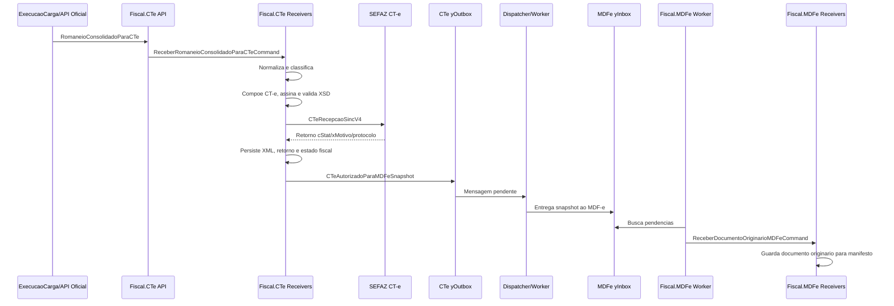

# CT-e - Fluxo Da Entrada Ate A Saida Para MDF-e

Consolidado em 2026-08-28.

Este documento desenha o fluxo do modulo Fiscal.CTe desde a recepcao de uma
entrada externa ou nativa, passando por classificacao, emissao SEFAZ e saida
para o modulo Fiscal.MDFe.

O objetivo e separar tres leituras do mesmo processo:

- algoritmo: ordem executavel dos passos;
- comportamento de negocio: decisoes fiscais e operacionais;
- comportamento de arquitetura: bordas, persistencia, inbox/outbox, workers e
  acoplamento permitido.

## Principio Do Fluxo

CT-e e dono da emissao do CT-e.

MDF-e nao deve consultar tabela interna do CT-e como caminho normal.

Quando um CT-e for autorizado, o modulo CT-e publica uma saida estavel:

- evento interno `CTeAutorizado`;
- snapshot `CTeAutorizadoParaMDFe`;
- mensagem em `yOutbox` para entrega ao modulo consumidor.

O MDF-e recebe esse snapshot pela sua propria `yInbox`, processado por Worker,
e decide se cria, atualiza ou ignora uma solicitacao de manifesto.

SOAP, REST legado, planilha e arquivo sao bordas de entrada externa. Eles
servem para compatibilidade com clientes, fabricantes, contingencia e legados.
Nao devem ser usados como integracao normal entre modulos Yeshua.

No primeiro recorte do modulo Fiscal.CTe, o legado fica fora do fiscal. O CT-e
recebe uma mensagem oficial, inicialmente `RomaneioConsolidadoParaCTe`,
produzida por modulo anterior de execucao/montagem de carga ou por uma API
nativa equivalente.

## Desenho Macro

```mermaid
flowchart LR
    A[Entrada externa ou nativa] --> B[CTeEntradaBruta]
    B --> C[Normalizacao]
    C --> D[CTeSolicitacaoFiscal]
    D --> E[Classificacao fiscal]
    E --> F[Pre-validacao]
    F --> G[Composicao CT-e interno]
    G --> H[XML oficial]
    H --> I[Assinatura]
    I --> J[Validacao XSD]
    J --> K[Cliente SEFAZ]
    K --> L[Retorno SEFAZ]
    L --> M{Resultado fiscal}
    M -->|Autorizado| N[Persistir procCTe/protocolo/XML]
    M -->|Rejeitado| O[Persistir rejeicao fiscal]
    M -->|Falha tecnica| P[Marcar reprocessamento]
    N --> Q[Gravar CTeAutorizado em Outbox]
    Q --> R[Dispatcher/Worker de entrega]
    R --> S[Inbox Fiscal.MDFe]
    S --> T[Worker MDF-e processa documento originario]
```



## Algoritmo Executavel

### 1. Receber Entrada

Entradas possiveis:

- REST nativo;
- arquivo;
- planilha;
- fila;
- mensagem interna vinda de inbox/outbox.

Passos:

1. Identificar origem oficial, tipo e versao da mensagem.
2. Extrair token.
3. Criar ou propagar `CorrelationId`.
4. Capturar payload/snapshot recebido.
5. Calcular hash do payload.
6. Montar `CTeEntradaOficial`.
7. Persistir entrada bruta se a politica exigir.
8. Verificar idempotencia.
9. Decidir se processa agora ou agenda.

Saidas possiveis:

- protocolo de recebimento;
- rejeicao tecnica imediata;
- command de normalizacao;
- item de inbox/worker.

### 2. Resolver Contexto

Passos:

1. Resolver token.
2. Identificar tenant.
3. Identificar cliente operacional, se existir.
4. Carregar configuracao fiscal do emitente.
5. Carregar ambiente: homologacao ou producao.
6. Carregar UF, municipio, IE, certificado de referencia e serie preferencial.
7. Resolver autorizador por UF e ambiente.

Regra:

- conector nao escolhe certificado diretamente;
- conector nao decide tenant por nome de endpoint;
- token e configuracao resolvem o contexto.

### 3. Normalizar Para Entrada Canonica

Passos:

1. Converter contrato externo para `CTeSolicitacaoFiscal`.
2. Mapear participantes.
3. Mapear documentos originarios.
4. Mapear carga.
5. Mapear valores.
6. Mapear ou inferir classificacao fiscal inicial.
7. Separar campos externos nao reconhecidos como diagnostico, nao como dominio.

Saida:

- `SolicitarEmissaoCTeCommand`.

### 4. Classificar Fiscalmente

Classificacoes minimas:

- produto fiscal: CT-e carga modelo 57, CT-e Simplificado, CT-e OS ou GTV-e;
- tipo de CT-e: normal, complemento ou substituicao;
- tipo de servico: normal, subcontratacao, redespacho, redespacho
  intermediario ou multimodal;
- modal: rodoviario, aereo, aquaviario, ferroviario, dutoviario ou multimodal;
- globalizado: sim ou nao;
- contingencia: normal, EPEC, SVC ou FS-DA.

Primeiro recorte:

- produto fiscal: CT-e carga modelo 57;
- tipo de CT-e: normal;
- tipo de servico: normal;
- modal: rodoviario;
- globalizado: nao;
- contingencia: normal.

Regra:

- classificacao e comportamento de negocio;
- nao deve ficar escondida no XML builder;
- quando o cenario nao for suportado, o fluxo deve falhar cedo com mensagem
  clara.

### 5. Pre-Validar

Validacoes estruturais:

- emitente configurado;
- certificado referenciado;
- ambiente definido;
- UF e municipio validos;
- participantes obrigatorios;
- documento originario quando exigido;
- valores minimos;
- modal suportado;
- tipo de servico suportado;
- politica de processamento permitida.

Validacoes fiscais profundas:

- ficam em policies especificas;
- devem ser confirmadas por schema/manual vigente antes de virar regra final.

Saidas possiveis:

- segue para composicao;
- falha de normalizacao;
- falha de pre-validacao;
- cenario nao suportado.

### 6. Compor Documento Fiscal Interno

Passos:

1. Reservar numeracao.
2. Gerar codigo numerico.
3. Gerar chave de acesso.
4. Montar entidade/documento interno `CTe`.
5. Vincular participantes.
6. Vincular documentos originarios.
7. Vincular carga.
8. Calcular rateio se necessario.
9. Calcular ou validar tributacao.
10. Criar `CTeTentativaEmissao`.

Regra:

- ate aqui ainda nao existe XML autorizado;
- o documento interno deve conseguir explicar por que aquele CT-e foi montado
  daquela forma.

### 7. Projetar XML Oficial

Passos:

1. Converter documento interno para XML oficial.
2. Aplicar versao de leiaute.
3. Aplicar tags por produto/tipo/modal.
4. Assinar grupo exigido.
5. Validar contra XSD.
6. Persistir XML pre-SEFAZ e hash.

Regra:

- XML builder nao calcula frete;
- XML builder nao busca dados no APS;
- XML builder materializa decisoes ja tomadas.

### 8. Transmitir Para SEFAZ

Passos:

1. Resolver endpoint por UF, ambiente, autorizador e servico.
2. Criar cliente HTTP/SOAP com certificado.
3. Enviar XML para `CTeRecepcaoSincV4` no primeiro recorte.
4. Capturar status HTTP.
5. Capturar retorno bruto.
6. Medir duracao.
7. Persistir tentativa.

Regra:

- cliente SEFAZ nao conhece pedido, carga, estoque, MDF-e ou APS;
- falha tecnica de comunicacao nao e rejeicao fiscal;
- retorno bruto deve ser preservado.

### 9. Interpretar Retorno

Resultados internos candidatos:

- autorizado;
- rejeitado;
- denegado, se aplicavel ao recorte vigente;
- falha de schema local;
- falha de assinatura;
- falha de certificado;
- falha de comunicacao;
- servico indisponivel;
- consumo indevido;
- retorno desconhecido.

Para cada retorno:

1. Interpretar `cStat` e `xMotivo`.
2. Persistir retorno bruto.
3. Persistir estado fiscal interno.
4. Persistir protocolo quando existir.
5. Vincular XML autorizado/procCTe quando autorizado.
6. Liberar ou bloquear saida para MDF-e.

Regra:

- somente CT-e autorizado deve alimentar MDF-e como documento originario valido;
- rejeicao fiscal gera diagnostico, nao documento para MDF-e;
- falha tecnica pode gerar reprocessamento.

### 10. Publicar Saida Fiscal

Se autorizado:

1. Criar evento interno `CTeAutorizado`.
2. Criar snapshot `CTeAutorizadoParaMDFe`.
3. Persistir a entrega em `yOutbox`.
4. O dispatcher/worker entrega para a `yInbox` do MDF-e.
5. O Worker do MDF-e executa o command interno de documento originario.

Se rejeitado:

1. Publicar `CTeRejeitado`, se houver consumidor operacional.
2. Nao enviar para MDF-e.

Se falha tecnica:

1. Publicar `CTeEmissaoFalhouTecnicamente`.
2. Marcar tentativa para reprocessamento conforme politica.
3. Nao enviar para MDF-e ate autorizacao.

## Comportamento De Negocio

### Entrada

O negocio reconhece uma intencao:

- receber carga;
- receber pedido/documento;
- solicitar emissao;
- reprocessar entrada;
- consultar situacao;
- cancelar/corrigir depois.

Essa intencao nao deve depender do canal. Um adapter legado ou uma API nativa
podem produzir a mesma mensagem oficial para o modulo CT-e.

### Classificacao

A classificacao fiscal responde:

- que produto fiscal sera gerado?
- e emissao normal, complemento ou substituicao?
- e servico normal, subcontratacao, redespacho, redespacho intermediario ou
  multimodal?
- existe agrupamento/globalizado?
- a operacao esta em contingencia?
- o modulo suporta esse cenario agora?

Se nao suporta, o fluxo deve parar antes de numeracao e antes de SEFAZ.

### Emissao

Emissao e uma tentativa fiscal controlada.

O negocio precisa saber:

- quem pediu;
- por qual conector;
- para qual tenant;
- com quais documentos;
- com quais valores;
- qual XML foi enviado;
- qual resposta a SEFAZ deu;
- se o CT-e ficou autorizado ou nao;
- se pode alimentar MDF-e.

### Saida Para MDF-e

Para o negocio, o MDF-e nao precisa saber como o CT-e foi emitido.

Ele precisa saber que existe um documento originario autorizado e usavel.

Portanto a saida deve ser snapshot, nao acesso direto ao banco do CT-e.

Esse snapshot deve trafegar por outbox/inbox. O CT-e nao chama endpoint SOAP,
REST ou receiver interno do MDF-e como caminho normal.

## Comportamento De Arquitetura

### Borda

A borda tecnica deve:

- receber protocolo externo;
- extrair token;
- capturar payload bruto;
- criar command;
- nao executar regra fiscal profunda.

Gerado pela Engine:

- endpoint REST;
- `.svc`/alias SOAP quando declarado;
- command;
- receiver;
- DI;
- pontos `Custon`;
- persistencia de entrada quando modelada na DSL.

Custom IA/dev:

- mapper da mensagem oficial para entrada fiscal;
- tratamento especifico do contrato nativo;
- resposta compativel com a API oficial do modulo.

### Application

Application orquestra:

- recepcao;
- normalizacao;
- validacao;
- emissao;
- publicacao de resultado.

Nao deve conter XML tag por tag.

### Domain

Domain decide/comporta:

- classificacao;
- coerencia fiscal de alto nivel;
- participantes;
- documentos;
- carga;
- valores;
- status fiscal interno;
- eventos de negocio.

Nao deve chamar SEFAZ.

### Infrastructure.Shared Do Aplicativo

Aqui ficam os miolos fiscais tecnicos reutilizados por API e Worker:

- XML;
- assinatura;
- XSD;
- cliente SEFAZ;
- endpoint resolver;
- certificado;
- DACTE;
- parser de retorno.

Isso pertence ao aplicativo Fiscal.CTe, nao ao Shared global.

### Worker / Inbox / Outbox

Usos:

- processar entrada assincrona;
- reprocessar falha tecnica;
- entregar evento para MDF-e;
- reconciliar situacao com SEFAZ.

Regra:

- worker nao deve conter regra propria paralela;
- worker chama receiver;
- receiver concentra fluxo executavel.

## Saida Para MDF-e

Contrato candidato:

```csharp
public sealed class CTeAutorizadoParaMDFeSnapshot
{
    public string CorrelationId { get; init; }
    public int TenantId { get; init; }
    public string ChaveAcessoCTe { get; init; }
    public string ProtocoloAutorizacao { get; init; }
    public DateTimeOffset AutorizadoEm { get; init; }
    public string EmitenteDocumento { get; init; }
    public string TomadorDocumento { get; init; }
    public string RemetenteDocumento { get; init; }
    public string DestinatarioDocumento { get; init; }
    public string UFInicio { get; init; }
    public string UFFim { get; init; }
    public string MunicipioInicioCodigoIbge { get; init; }
    public string MunicipioFimCodigoIbge { get; init; }
    public string Modal { get; init; }
    public decimal ValorServico { get; init; }
    public decimal ValorCarga { get; init; }
    public string XmlStorageKey { get; init; }
    public string XmlHash { get; init; }
}
```

Contrato alternativo para o MDF-e:

```csharp
public sealed class ReceberDocumentoOriginarioMDFeCommand
{
    public string Origem { get; init; }
    public string CorrelationId { get; init; }
    public int TenantId { get; init; }
    public string TipoDocumento { get; init; }
    public string ChaveAcesso { get; init; }
    public string ProtocoloAutorizacao { get; init; }
    public string EmitenteDocumento { get; init; }
    public string UFInicio { get; init; }
    public string UFFim { get; init; }
    public string MunicipioInicioCodigoIbge { get; init; }
    public string MunicipioFimCodigoIbge { get; init; }
    public string ReferenciaExterna { get; init; }
}
```

Decisao sugerida:

- CT-e publica `CTeAutorizadoParaMDFeSnapshot` em `yOutbox`;
- a entrega entre aplicativos ocorre por dispatcher/worker;
- MDF-e persiste a mensagem recebida em sua `yInbox`;
- MDF-e recebe por um command generico
  `ReceberDocumentoOriginarioMDFeCommand`, disparado pelo Worker do proprio
  MDF-e;
- o mapper entre snapshot e command pode ser simples e explicito.

Assim, MDF-e tambem pode receber NF-e, CT-e Simplificado ou outros documentos
sem depender de classes internas do CT-e.

## Sequencia Com MDF-e



## Sincrono Versus Assincrono

### Sincrono Ate Autorizacao

Uso:

- teste guiado;
- cliente que precisa resposta fiscal imediata;
- volume baixo;
- operacao onde timeout e aceitavel.

Retorno:

- autorizado com chave/protocolo;
- rejeitado com `cStat`/`xMotivo`;
- falha tecnica clara.

### Assincrono

Uso:

- integracao oficial de modulo com resposta por protocolo interno;
- alto volume;
- integracao por arquivo;
- SEFAZ instavel;
- necessidade de reprocessamento.

Retorno:

- protocolo interno de recebimento;
- status inicial;
- forma de consultar depois.

Processamento:

- worker chama receivers;
- resultado fiscal fica persistido;
- eventos saem por outbox.

### Hibrido

Uso:

- recebe, normaliza e valida na hora;
- se passar, agenda emissao;
- se falhar estruturalmente, responde erro imediato.

Esse pode ser o melhor padrao para entradas oficiais que nao podem bloquear o
produtor do evento.

## Estados Internos Candidatos

### Entrada

- `Recebida`
- `Duplicada`
- `Normalizada`
- `NormalizacaoComErro`
- `Agendada`
- `Processando`
- `Concluida`

### Solicitacao CT-e

- `AguardandoValidacao`
- `Validada`
- `ReprovadaNaPreValidacao`
- `AguardandoEmissao`
- `EmEmissao`
- `Autorizada`
- `Rejeitada`
- `FalhaTecnica`
- `AguardandoReprocessamento`
- `Cancelada`

### Saida Para MDF-e

- `NaoElegivel`
- `AguardandoPublicacao`
- `Publicado`
- `ConsumidoPeloMDFe`
- `FalhaNaEntrega`

## Tabela De Decisao

| Situacao | Persistir entrada | Chamar SEFAZ | Publicar para MDF-e | Reprocessar |
| --- | --- | --- | --- | --- |
| Payload invalido | Sim | Nao | Nao | Nao, salvo correcao externa |
| Token invalido | Opcional | Nao | Nao | Nao |
| Cenario nao suportado | Sim | Nao | Nao | Nao |
| Pre-validacao falhou | Sim | Nao | Nao | Depende da correcao |
| XSD falhou | Sim | Nao | Nao | Sim, se erro for corrigivel |
| Falha de certificado | Sim | Nao/Interrompe | Nao | Sim, apos correcao |
| Falha de comunicacao | Sim | Tentou | Nao | Sim |
| Rejeicao SEFAZ | Sim | Sim | Nao | Depende do cStat |
| Autorizado | Sim | Sim | Sim | Nao |

## O Que A Engine Gera

- commands;
- receivers base;
- endpoints REST;
- conectores declarados na DSL;
- aliases de rota;
- tabelas operacionais declaradas;
- repositories;
- DI;
- worker quando houver inbox/outbox;
- marcadores de ownership;
- pontos `Custon`.

## O Que Fica No Miolo

- mapper do contrato externo;
- classificacao fiscal profunda;
- regras de redespacho, complemento, substituicao e globalizado;
- rateio;
- tributacao;
- XML oficial;
- assinatura;
- validacao XSD;
- cliente SEFAZ;
- parser de retorno;
- decisao de reprocessamento por `cStat`;
- mapper da saida CT-e para snapshot de outbox consumivel pelo MDF-e.

## Primeiro Recorte Implementavel

Para evitar monstro:

1. Receber `RomaneioConsolidadoParaCTe` pela API oficial ou inbox.
2. Persistir `CTeEntradaOficial`.
3. Normalizar para `CTeSolicitacaoFiscal`.
4. Suportar apenas CT-e modelo 57 normal rodoviario.
5. Gerar XML, assinar e validar XSD.
6. Enviar para homologacao.
7. Persistir retorno.
8. Se autorizado, publicar snapshot em `yOutbox`.
9. Dispatcher/worker entrega o snapshot para a `yInbox` do MDF-e.
10. MDF-e apenas guarda documento originario recebido.

Ficam fora do primeiro recorte:

- redespacho real;
- complemento;
- substituicao;
- globalizado;
- contingencia;
- CT-e Simplificado;
- CT-e OS;
- GTV-e;
- DACTE completo;
- distribuicao DF-e.

Esses pontos ficam desenhados, mas nao entram no primeiro codigo.

## Perguntas Antes De Implementar

- A primeira entrada sera API oficial nativa, inbox, ou as duas?
- O primeiro retorno ao cliente precisa esperar autorizacao SEFAZ ou apenas
  protocolo interno?
- A tabela de entrada bruta sera especifica do CT-e ou `yInbox`?
- Qual e o menor conjunto de campos reais para emitir o primeiro CT-e normal
  rodoviario em homologacao?

## Decisao Atual

A direcao recomendada e:

- entrada bruta sempre separada da solicitacao fiscal;
- CT-e emite e publica snapshot em `yOutbox`;
- MDF-e consome snapshot por `yInbox`/Worker e executa command proprio;
- nenhum modulo fiscal acessa tabela interna do outro como caminho quente;
- SOAP/REST legado nao e barramento interno entre modulos Yeshua;
- Engine gera bordas;
- IA/dev implementa miolos fiscais.
